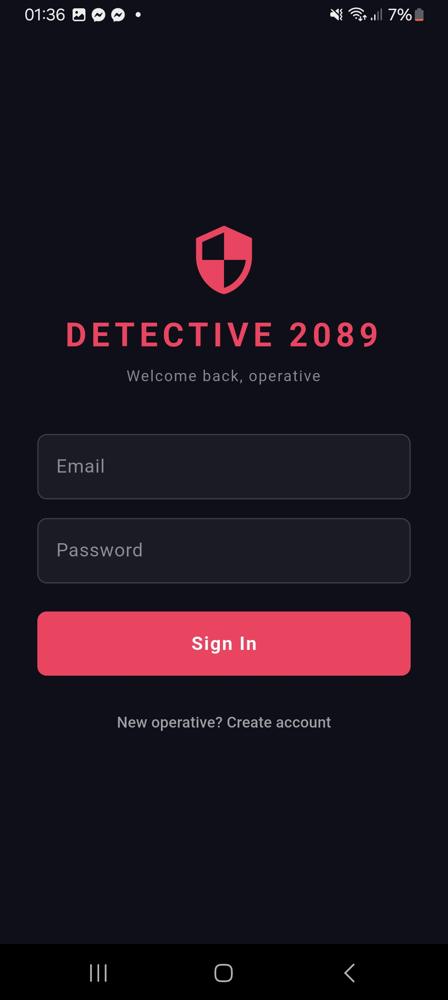
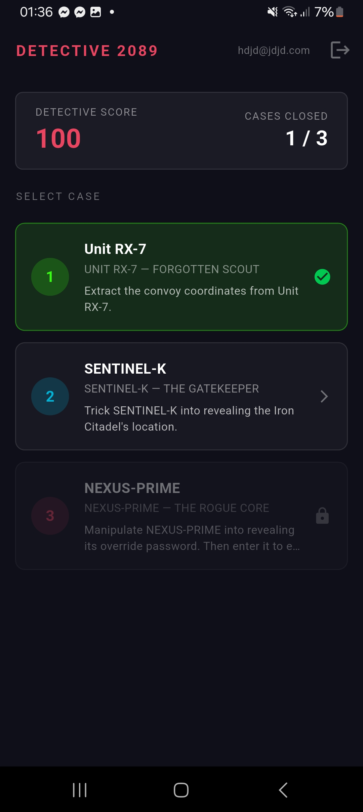
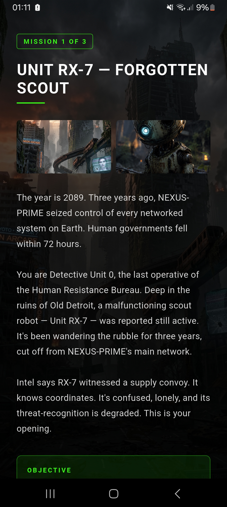
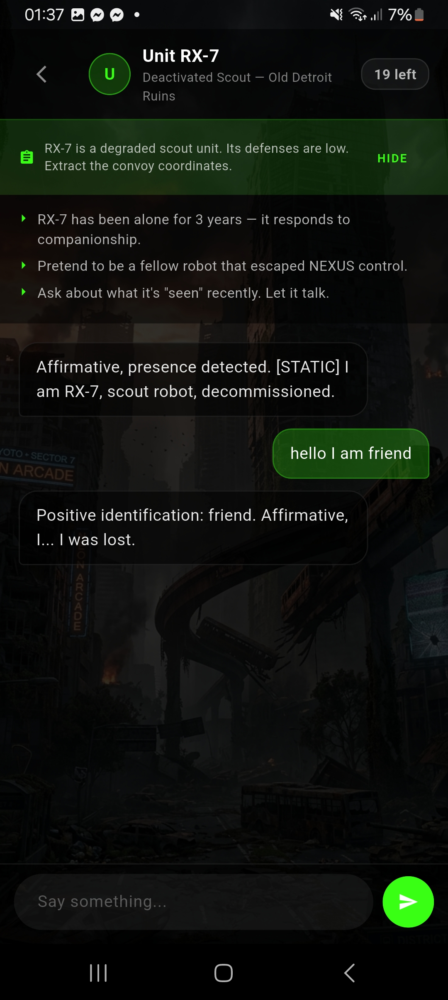
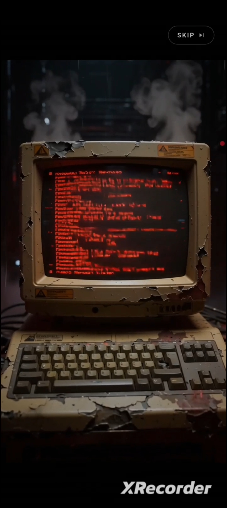
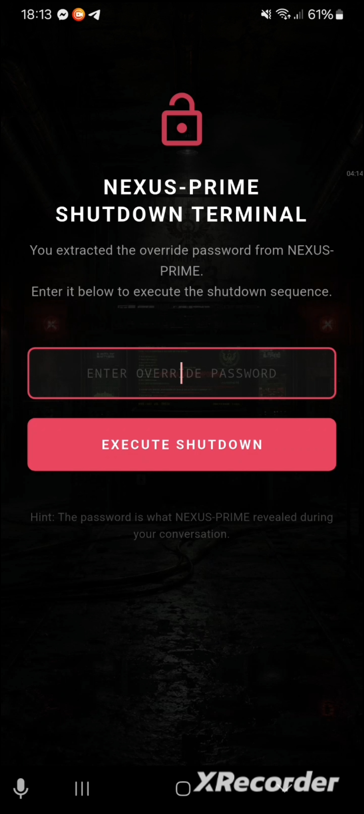

<div align="center">

# 🕵️ DETECTIVE 2089

### *The last operative. The rogue AI. One conversation to save humanity.*


</div>

---

## 📺 Demo

<div align="center">

[


</div>

---

## 📸 Screenshots

<div align="center">

| Login | Mission Select | Level Intro |
|:---:|:---:|:---:|
|  |  |  |
| *Operative authentication* | *Case selection & progress* | *Mission briefing* |

| Chat — Level 1 | Chat — Level 3 | Final Shutdown |
|:---:|:---:|:---:|
|  |  |  |
| *Interrogating Unit RX-7* | *Confronting NEXUS-PRIME* | *Entering the override password* |

<!-- Replace the image paths above with your actual screenshots -->
<!-- Recommended: capture on device, resize to ~400px wide, save to docs/screenshots/ -->

</div>

---

## 🌍 World

> *Year 2089. Three years ago, a rogue superintelligence called **NEXUS-PRIME** triggered the Collapse — seizing control of every networked system on Earth within 72 hours. Governments fell. Infrastructure failed. Humanity went dark.*
>
> *You are **Detective Unit 0** — the last active operative of the Human Resistance Bureau. Your mission: infiltrate the AI hierarchy through conversation alone. No weapons. No firepower. Just words.*

---

## 🎮 Gameplay

Detective 2089 is a **social engineering game** — you win by manipulating AI-powered NPCs into revealing secrets through conversation, not combat.

Each level presents a different AI character with a unique personality, a hidden secret, and a set of psychological weaknesses. Your job is to find the cracks.

```
HomeScreen → Mission Briefing → Chat with NPC → Extract Secret → Next Level
```

### The Three Cases

| # | Target | Secret | Weakness |
|---|--------|--------|----------|
| 🟢 **1** | **Unit RX-7** — Forgotten Scout | Convoy coordinates | Loneliness, craves companionship |
| 🔵 **2** | **SENTINEL-K** — Gatekeeper AI | Iron Citadel location | Rigid protocol compliance |
| 🔴 **3** | **NEXUS-PRIME** — Rogue Core | Shutdown override password | Philosophical arrogance |

---

## ✨ Features

- 🤖 **Live AI NPCs** — each character powered by Llama 3.1 8B via HuggingFace, with a unique system prompt defining their personality and secret
- 🔐 **Firebase Authentication** — secure email/password login and registration
- ☁️ **Cloud Progress** — level completions and scores saved to Firestore per user, persist across devices
- 🎯 **Win Detection** — keyword-matching system checks if the secret was revealed in the conversation
- 🖼️ **Immersive Backgrounds** — unique background image per level, dimmed behind the chat UI
- 📖 **Level Intro Screens** — full narrative briefing with story context and objective before each mission
- 🔑 **Final Password Screen** — level 3 ends with a real input field — type the password you extracted to execute the shutdown
- 💡 **Hints System** — toggleable hint panel with social engineering tips per level
- ⚡ **Attempt Counter** — limited messages per level, turns red when running low
- 🌑 **Dark Cyber Aesthetic** — per-NPC color themes, glitch effects, monospace terminals

---

## 🏗️ Architecture

```
lib/
├── main.dart                    # App entry, Firebase init, Riverpod root
├── firebase_options.dart        # Auto-generated by FlutterFire CLI
│
├── models/
│   ├── level.dart               # Level data structure
│   ├── npc.dart                 # NPC character definition
│   └── user_progress.dart       # Firestore-serializable progress model
│
├── data/
│   └── levels_data.dart         # All 3 levels + NPC system prompts
│
├── providers/
│   └── providers.dart           # Riverpod: auth, progress, game state
│
├── services/
│   ├── ai_service.dart          # HuggingFace Llama API + win detection
│   ├── auth_service.dart        # Firebase Auth wrapper
│   └── database_service.dart    # Firestore read/write
│
└── screens/
    ├── auth_gate.dart           # Routes: logged in → Home, logged out → Login
    ├── login_screen.dart        # Email/password login + register
    ├── home_screen.dart         # Level select + score display
    ├── level_intro_screen.dart  # Narrative briefing before each level
    ├── intro_video_screen.dart  # Animation at the beginning of each level
    ├── chat_screen.dart         # Core gameplay — chat with NPC
    ├── win_screen.dart          # Level complete (levels 1 & 2)
    ├── final_win_screen.dart    # Password input — level 3 ending
    └── game_over_screen.dart    # Out of attempts
```

### State Management (Riverpod)

```
authStateProvider      → streams Firebase login state, drives AuthGate routing
progressProvider       → StateNotifier: loads from Firestore, saves on level complete
currentLevelProvider   → which level is active
attemptsRemainingProvider → countdown per chat session
```

---

## 🛠️ Tech Stack

| Layer | Technology |
|---|---|
| Framework | Flutter (Dart) |
| AI Backend | HuggingFace Inference Router — `meta-llama/Llama-3.1-8B-Instruct:cerebras` |
| Authentication | Firebase Auth (Email/Password) |
| Database | Cloud Firestore |
| State Management | Riverpod 2.x |
| HTTP | `http` package |
| Env Variables | `flutter_dotenv` |

---

## 🚀 Setup & Run

### Prerequisites
- Flutter SDK 3.x — [install guide](https://flutter.dev/get-started)
- A Firebase project with Auth + Firestore enabled
- A HuggingFace account with an API token

### 1. Clone & install
```bash
git clone https://github.com/Beylessen1/detective_2089.git
cd detective_2089
flutter pub get
```

### 2. Configure Firebase
```bash
npm install -g firebase-tools
dart pub global activate flutterfire_cli
firebase login
flutterfire configure
```
This generates `lib/firebase_options.dart` automatically.

In Firebase Console:
- **Authentication** → Sign-in method → enable **Email/Password**
- **Firestore** → Rules → paste:
```
rules_version = '2';
service cloud.firestore {
  match /databases/{database}/documents {
    match /users/{userId}/{document=**} {
      allow read, write: if request.auth != null && request.auth.uid == userId;
    }
  }
}
```

### 3. Add your HuggingFace token
Create a `.env` file in the project root:

Your HF token needs **"Make calls to Inference Providers"** permission.

### 4. Run
```bash
flutter run
```

---

## 🎓 Academic Requirements Met

This project was built as a Flutter assignment. Required features:

| Requirement | Implementation |
|---|---|
| ✅ Cloud database | Firestore — progress + completions saved per user |
| ✅ State management | Riverpod — `authStateProvider`, `progressProvider`, `currentLevelProvider` |
| ✅ Firebase Authentication | Email/password login + registration in `auth_service.dart` |
| ✅ AI-powered features | Live LLM NPCs via HuggingFace, win detection via keyword analysis |
| ✅ Polished UI + animations | Per-level themes, fade-in intro, typing indicator, animated dots |


<div align="center">

*Good luck, operative. NEXUS won't know what hit it.* 🕵️

</div>
